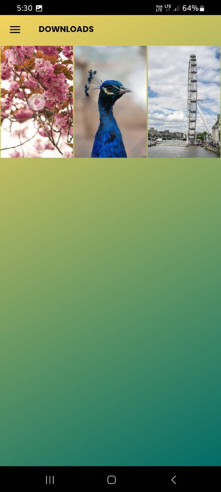

# Wallpaper Wonders - Ultimate Wallpaper App

Experience a new level of personalization with Wallpaper Wonders! Our app provides an extensive
collection of photos and videos from PIXABAY and PEXELS, enabling you to enhance your device’s look
with stunning wallpapers. Explore, download, and set your favorites as wallpapers with ease.

## **Features**

🖼️ **Diverse Photo Collection**:

- Browse high-quality images from PIXABAY, organized by categories for easy access.

🎥 **Expansive Video Library**:

- Explore a variety of videos from PEXELS, available in different categories.

🌟 **Curated Collections**:

- Discover themed photo and video collections from PEXELS, sorted by categories.

🖌️ **Set as Wallpaper**:

- Set any photo or video as your wallpaper for both home and lock screens with just a tap.

📥 **Download and Save**:

- Download your preferred photos and videos, and manage them in the Downloads screen.

📂 **View Downloaded Wallpapers**:

- Easily access all your downloaded wallpapers in one place, with an organized view.

## **Prerequisites**

Before using the app, ensure you have the following:

1. **Internet Access**:
    - A stable internet connection is required to fetch photos and videos from PIXABAY and PEXELS.

## **Setup**

Follow these steps to set up the Wallpaper Wonders App:

1. **Clone the Repository**:
    - Clone the repository from [GitHub](https://github.com/PriyankaMakwana810/WallpaperWonders.git).

2. **Open in Android Studio**:
    - Open the project in Android Studio.

3. **Configure API Keys**:
    - Obtain API keys from [PIXABAY](https://pixabay.com/api/docs/)
      and [PEXELS](https://www.pexels.com/api/).
    - Add your API keys in the `Constants.kt` file:
      ```properties
      PIXABAY_API_KEY=your_pixabay_api_key
      AUTHORIZATION_KEY(PEXELS_API_KEY)=your_pexels_api_key
      ```

4. **Build and Run**:
    - Build and run the app on an Android emulator or device.

## **Usage**

1. **Home Screen**:
    - The home screen features a bottom navigation bar with options for Photos, Videos, Collections,
      and Downloads.
    - Photos: Browse high-quality images from PIXABAY.
    - Videos: Explore engaging videos from PEXELS.
    - Collections: Discover curated collections from PEXELS.
    - Downloads: View all your downloaded wallpapers.

2. **Setting a Wallpaper**:
    - Tap on a photo or video to open its detail view.
    - Tap the "Set as Wallpaper" button and choose to apply it to the home screen, lock screen, or
      both.

3. **Managing Downloads**:
    - Access your downloaded wallpapers in the Downloads screen for easy reapplication or removal.

## **Dependencies**

- [Kotlin](https://kotlinlang.org/) for app development
- [Retrofit](https://square.github.io/retrofit/) for API integration
- [Glide](https://github.com/bumptech/glide) for image loading
- [ExoPlayer](https://exoplayer.dev/) for video playback

## **Notes**

Ensure that you have a stable internet connection for fetching and downloading wallpapers.

Feel free to reach out with any feedback or suggestions. Enjoy customizing your device with
Wallpaper Wonders!

## **Screenshots**



